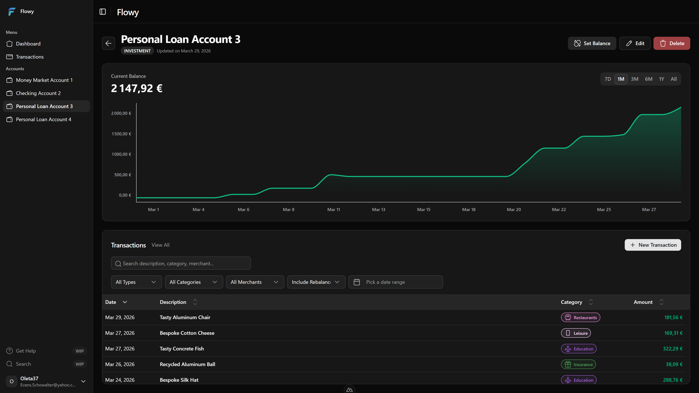

# Flowy

**Turn household money chaos into a clear, shared financial system.**



Flowy is a self-hosted finance platform built for people who are tired of juggling spreadsheets, disconnected banking apps, and shared Google Sheets that nobody agrees on.

One place. All your accounts. Everyone in the loop.

---

## Who it's for

**Couples and families** who want a shared view of spending without emailing each other CSV exports.

**People leaving spreadsheets** who need structure without sacrificing flexibility.

**Self-hosters** who want financial tooling without handing their data to a third party.

**Households with multiple accounts** that need consistent categorization month after month.

---

## What Flowy gives you

### 🏠 A shared household workspace

Create a family space and work on the same financial picture together. Invite your partner or family members — everyone sees the same data, in real time.

### 🏦 All your accounts in one place

Manage checking, savings, credit, cash, investment, and custom account types from a single dashboard. No more switching between apps to get the full picture.

### 🧾 Transactions that actually make sense

Classify each transaction with merchants and categories you define. Build your own catalog, adapted to how you actually spend money — not some generic preset list.

### 🔒 Your data, your server

Flowy is self-hosted. You control the deployment, the database, and who has access. No third-party sync, no subscription required, no data harvested.

---

## How it works

**Get started fast** — register, sign in, pick your onboarding path, and start tracking in minutes.

**Build your household** — create a family workspace or join one through an invite link.

**Track real money movement** — add accounts, monitor balances, and record transactions as they happen.

**Organize your spending** — structure data with reusable categories and merchants for visibility that actually improves over time.

**Manage everything from settings** — update your profile, family details, and references. Admins can configure instance-level behavior.

---

## Flowy vs spreadsheet

|                   | Flowy                                                | Spreadsheet                      |
| ----------------- | ---------------------------------------------------- | -------------------------------- |
| **Onboarding**    | Guided setup and family invites                      | Manual tab setup                 |
| **Collaboration** | Shared household context                             | File links and version confusion |
| **Structure**     | Accounts, categories, merchants, transactions        | Free-form cells                  |
| **Consistency**   | Reusable references, standardized entries            | Ad hoc naming                    |
| **Scale**         | Built for long-term history and multi-user workflows | Fragile growth                   |

---

## Deploy in minutes

Flowy ships as a Docker Compose stack. Pull, configure, run.

```bash
docker compose -f docker-compose.yaml up -d
```

For full deployment instructions across all environments (standard, dev, Coolify), see **[DEPLOYMENT.md](./DEPLOYMENT.md)**.

---

## For developers

### Tech stack

- **Runtime / tooling**: Bun 1.3+, Node 20+
- **Frontend**: Nuxt 4, Vue 3, Tailwind CSS 4, Pinia, shadcn-nuxt
- **Backend**: NestJS 11, Fastify, Swagger, JWT, class-validator
- **Database**: PostgreSQL + Prisma

### Repository structure

```
web/                        # Frontend application
server/                     # Backend API and business logic
docker-compose.yaml         # Production stack (prebuilt images)
docker-compose.dev.yaml     # Local dev stack (Docker builds)
docker-compose.coolify.yaml # Coolify-oriented deployment
DEPLOYMENT.md               # Full deployment guide
```

### Prerequisites

- Bun `1.3.x`
- Node `20+`
- Docker + Docker Compose v2 (for containerized workflows)
- PostgreSQL (if running without Docker)

### Local setup (without Docker)

```bash
# Install workspace dependencies
bun install

# Copy environment files
cp server/.env.example server/.env
cp web/.env.example web/.env
```

Configure required variables in `server/.env`:

| Variable       | Description                                |
| -------------- | ------------------------------------------ |
| `DATABASE_URL` | PostgreSQL connection string               |
| `APP_NAME`     | App name used by JWT issuer and docs       |
| `APP_SECRET`   | Secret for JWT/cookies (required)          |
| `NODE_ENV`     | `development` \| `production` \| `test`    |
| `PREFIX`       | Global API prefix (optional)               |
| `CORS_ORIGINS` | Comma-separated allowed origins (optional) |

Frontend (`web/.env`):

| Variable               | Description         |
| ---------------------- | ------------------- |
| `NUXT_PUBLIC_API_BASE` | Public API base URL |

```bash
# Generate Prisma client and run migrations (from server/)
bunx prisma generate
bunx prisma migrate dev --name init

# Start backend (from server/)
bun run dev

# Start frontend (from web/)
bun run dev
```

Default local URLs:

- Frontend: `http://localhost:3000`
- API: `http://localhost:4000`
- Swagger: `http://localhost:4000/api`

### Docker dev setup

```bash
# Build and run the full local stack
docker compose -f docker-compose.dev.yaml up --build -d

# Follow logs
docker compose -f docker-compose.dev.yaml logs -f

# Stop the stack
docker compose -f docker-compose.dev.yaml down
```

### Scripts

**Root**

- `bun run lint` — run oxlint + oxfmt check
- `bun run lint:fix` — auto-fix lint and formatting

**Frontend (`web/`)**

- `bun run dev` — start Nuxt dev server
- `bun run build` — production build
- `bun run preview` — serve production build locally
- `bun run generate` — generate static output

**Backend (`server/`)**

- `bun run dev` — run API in hot-reload mode
- `bun run start` — start Nest via Bun
- `bun run build` — bundle app into `dist/`
- `bun run start:prod` — run compiled app from `dist/app`

### Database and seeding

```bash
# From server/
bunx prisma generate
bunx prisma migrate dev --name <migration_name>
bunx prisma db seed
```

> The server Docker image runs `prisma migrate deploy` then `prisma db seed` at startup. Seed includes default instance config and development data when `NODE_ENV=development`.

---

## License

Licensed under `CC-BY-NC-ND`. See [LICENSE.md](./LICENSE.md) for details.
