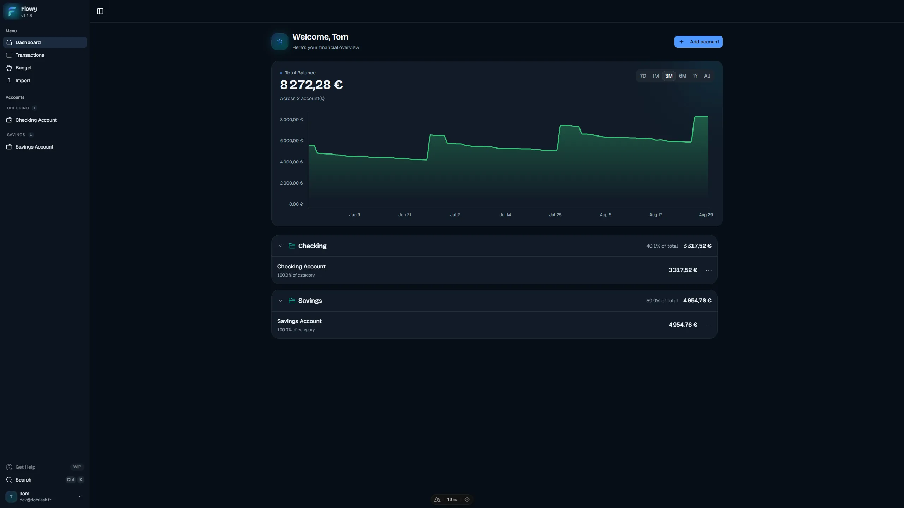
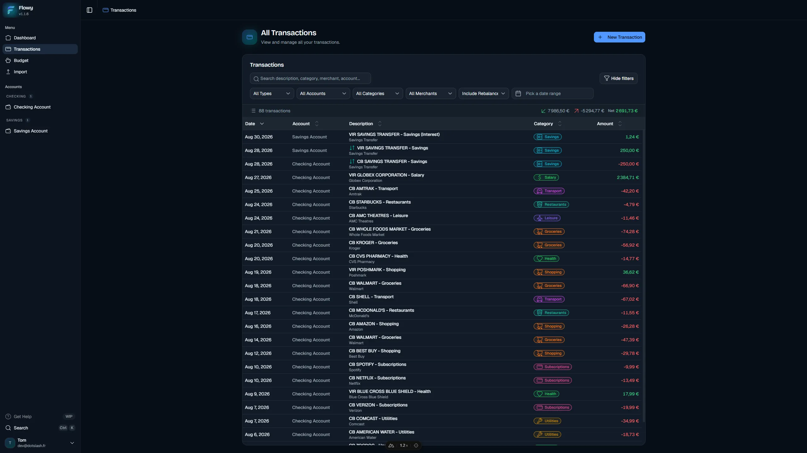
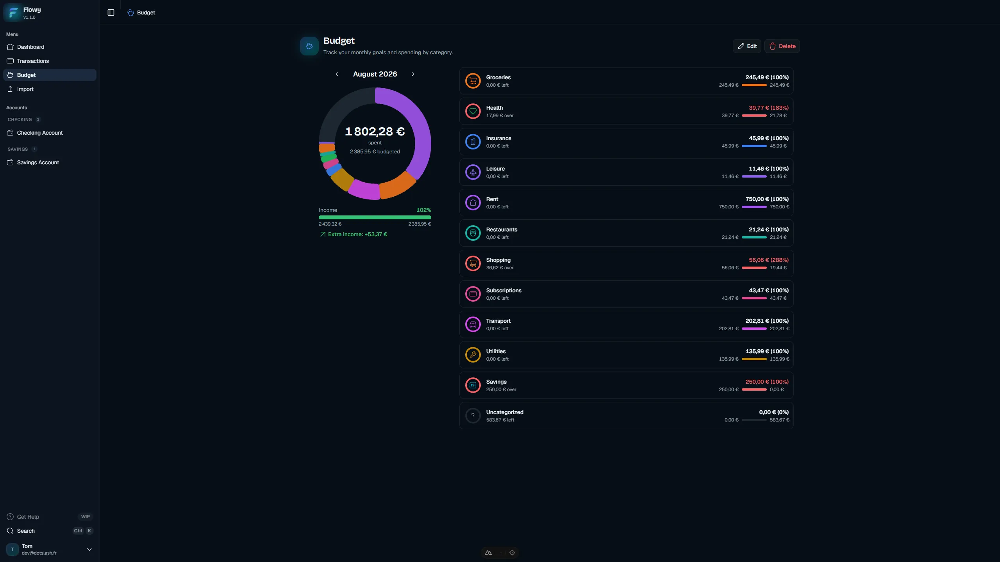

[](./LICENSE)
[](./.github/workflows/e2e.yml)
[](./DEPLOYMENT.md)
[](https://nuxt.com)
[](https://nestjs.com)
[](https://www.postgresql.org)

# Flowy

Flowy is a self-hosted finance platform built for people who are tired of juggling spreadsheets, disconnected banking apps, and shared Google Sheets that nobody agrees on.

Think of it as a self-hosted alternative to shared spreadsheets and subscription finance apps, purpose-built for couples, families and roommates who share money.



## Highlights

- Everyone sees the same picture. Invite your partner or family to a shared workspace and stop emailing exports back and forth.
- All your money in one dashboard. Checking, savings, credit, cash, investment and custom accounts tracked side by side.
- Categorization that fits your household. Build your own merchant and category catalog instead of adapting to a generic preset.
- Your data stays on your server. Runs on your own PostgreSQL through Docker Compose. No third-party sync, no subscription, no telemetry.

## 🚀 Try it in one command

```bash
docker compose -f docker-compose.yaml up -d
```

Then open `http://localhost:3000`. For production deployments and platform-specific setups (Coolify, dev builds), see [DEPLOYMENT.md](./DEPLOYMENT.md).

## 📷 Screenshots

Every transaction in one place. Filter by account, category or merchant, and categorize inline as you go.



Set a budget per category and see how the household tracks against it month after month.



## 🔗 Quick links

- Deployment guide: [DEPLOYMENT.md](./DEPLOYMENT.md)
- Development setup: [see below](#development)
- Contributing: [CONTRIBUTING.md](./CONTRIBUTING.md)
- Security policy: [SECURITY.md](./SECURITY.md)
- License: [LICENSE](./LICENSE)

## 🗺️ Roadmap

Actively developed. Currently planned:

- Recurring transactions with calendar view
- CSV/PDF export and GDPR-compliant account deletion
- Shared account access with permissions and activity log
- Bank aggregator integration (optional)
- Loan tracking
- Investment portfolio tracking
- MCP server and LLM assistant (optional)
- Theming

## Tech stack

- Runtime: Bun 1.3+, Node 20+
- Frontend: Nuxt 4, Vue 3, Tailwind CSS 4, Pinia, shadcn-nuxt
- Backend: NestJS 12, Fastify, Prisma, JWT
- Database: PostgreSQL (tensorchord/vchord-postgres)

## Repository layout

```
web/                        # Nuxt frontend
server/                     # NestJS backend and Prisma schema
.github/                    # Issue and PR templates
docker-compose.yaml         # Production stack (prebuilt images)
docker-compose.dev.yaml     # Local dev stack (Docker builds)
docker-compose.coolify.yaml # Coolify deployment
DEPLOYMENT.md               # Full deployment guide
CONTRIBUTING.md             # Contribution guide
SECURITY.md                 # Security policy and disclosure
AGENTS.md                   # Full conventions (AI/automation reference)
```

## Development

### Prerequisites

- Bun `1.3.x`
- Node `20+`
- Docker and Docker Compose v2 (for containerized workflows)
- PostgreSQL if you run the backend without Docker

### Local setup (without Docker)

```bash
# From the repo root
bun install

# Copy environment files
cp server/.env.example server/.env
cp web/.env.example web/.env
```

Backend variables (`server/.env`):

| Variable       | Description                                |
| -------------- | ------------------------------------------ |
| `DATABASE_URL` | PostgreSQL connection string               |
| `APP_NAME`     | App name used by JWT issuer and docs       |
| `APP_SECRET`   | Secret for JWT and cookies (required)      |
| `NODE_ENV`     | `development`, `production` or `test`      |
| `PREFIX`       | Global API prefix (optional)               |
| `CORS_ORIGINS` | Comma-separated allowed origins (optional) |

Frontend variables (`web/.env`):

| Variable               | Description         |
| ---------------------- | ------------------- |
| `NUXT_PUBLIC_API_BASE` | Public API base URL |

Initialize the database and start both apps:

```bash
# From server/
bunx prisma generate
bunx prisma migrate dev --name init
bun run dev

# From web/ in another terminal
bun run dev
```

Default local URLs:

- Frontend: `http://localhost:3000`
- API: `http://localhost:4000`
- Swagger: `http://localhost:4000/api`

### Docker dev setup

```bash
docker compose -f docker-compose.dev.yaml up --build -d
docker compose -f docker-compose.dev.yaml logs -f
docker compose -f docker-compose.dev.yaml down
```

### Scripts

Root:

- `bun run lint` runs oxlint and oxfmt in check mode
- `bun run lint:fix` applies auto-fixes and formatting

Frontend (`web/`):

- `bun run dev` starts the Nuxt dev server
- `bun run build` produces a production build
- `bun run preview` serves the production build locally
- `bun run generate` produces static output

Backend (`server/`):

- `bun run dev` runs the API in hot-reload mode
- `bun run start` starts Nest via Bun
- `bun run build` bundles the app into `dist/`
- `bun run start:prod` runs the compiled app from `dist/app`

### Database and seeding

```bash
# From server/
bunx prisma generate
bunx prisma migrate dev --name <migration_name>
bunx prisma db seed
```

The backend Docker image runs `prisma migrate deploy` then `prisma db seed` at startup. Seed data includes the default instance configuration, plus development fixtures when `NODE_ENV=development`.

## Contributing

See [CONTRIBUTING.md](./CONTRIBUTING.md) for setup, conventions and pull request guidelines.

## License

Licensed under [CC-BY-NC-SA 4.0](./LICENSE).
